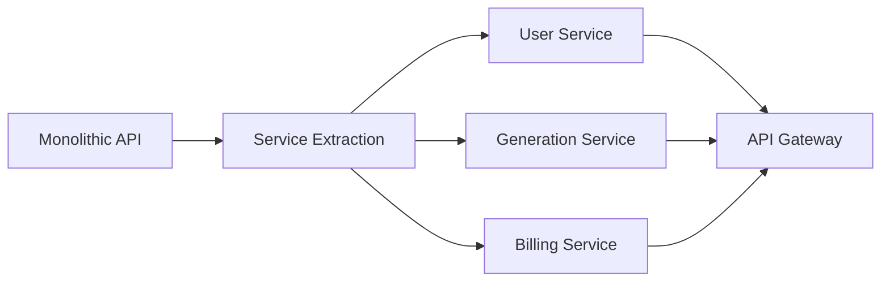

# 🏗️ AI Podcast Generator - Technical Architecture

## Executive Summary

This document outlines the comprehensive technical architecture for the AI Podcast Generator SaaS platform, a BYOK (Bring Your Own Key) model that enables users to create complete podcast episodes from idea to downloadable resources. The system leverages multiple AI services (OpenAI, ElevenLabs, Flux, Hailao) while maintaining a credit-based platform fee structure.

---

## 1. System Overview

### 1.1 Architecture Philosophy
- **Microservices-Ready**: Modular design for future scaling
- **BYOK Model**: Users bring their own API keys for external services
- **Credit-Based Economics**: Platform fees charged via internal credit system
- **Fault-Tolerant**: Robust error handling with credit refunds
- **Multi-Language Support**: Thai and English language capabilities

### 1.2 High-Level Architecture

```
┌─────────────────┐    ┌─────────────────┐    ┌─────────────────┐
│   Frontend      │    │   Backend API   │    │   External APIs │
│   (Next.js)     │◄──►│   (FastAPI)     │◄──►│   (OpenAI, KIE, │
│                 │    │                 │    │    ElevenLabs)  │
└─────────────────┘    └─────────────────┘    └─────────────────┘
                                │
                       ┌─────────────────┐
                       │  Task Queue     │
                       │  (Celery/RQ)    │
                       └─────────────────┘
                                │
                       ┌─────────────────┐
                       │  Data Layer     │
                       │  PostgreSQL +   │
                       │  File Storage   │
                       └─────────────────┘
```

---

## 2. Technology Stack

### 2.1 Frontend Layer
- **Framework**: Next.js 14+ (React 18+)
- **Styling**: Tailwind CSS + Headless UI
- **State Management**: Zustand / React Query
- **Forms**: React Hook Form + Zod validation
- **File Upload**: React Dropzone
- **Audio Player**: Howler.js
- **Charts**: Recharts (analytics dashboard)

### 2.2 Backend Layer
- **Framework**: FastAPI (Python 3.11+)
- **Async Runtime**: Uvicorn + Gunicorn
- **API Documentation**: OpenAPI/Swagger (auto-generated)
- **Validation**: Pydantic models
- **Authentication**: JWT + OAuth2

### 2.3 Data & Storage
- **Primary Database**: PostgreSQL 15+
- **Cache Layer**: Redis (session store, task queue)
- **File Storage**: AWS S3 / Cloudflare R2
- **CDN**: Cloudflare (static assets)
- **Backup**: Daily automated backups with point-in-time recovery

### 2.4 Infrastructure & DevOps
- **Containerization**: Docker + Docker Compose
- **Orchestration**: Kubernetes (production)
- **CI/CD**: GitHub Actions
- **Monitoring**: Prometheus + Grafana
- **Logging**: ELK Stack (Elasticsearch, Logstash, Kibana)
- **Error Tracking**: Sentry

---

## 3. System Components

### 3.1 Frontend Components

#### 3.1.1 Core Pages
- **Landing Page**: Marketing and feature overview
- **Dashboard**: User projects and credit management
- **Project Creator**: Step-by-step podcast creation flow
- **Project Editor**: Script editing and resource management
- **Settings**: API keys and profile management
- **Billing**: Credit purchase and transaction history

#### 3.1.2 Key Components
```
components/
├── ui/                    # Reusable UI components
├── forms/                 # Form components with validation
├── audio/                 # Audio player and controls
├── video/                 # Video player and preview
├── editor/                # Script editor with rich text
├── dashboard/             # Dashboard widgets and charts
├── billing/               # Credit purchase and management
└── layout/                # Layout and navigation components
```

### 3.2 Backend Services

#### 3.2.1 API Gateway
```python
# Core API endpoints
/api/v1/auth/              # Authentication & authorization
/api/v1/users/             # User management
/api/v1/projects/          # Project CRUD operations
/api/v1/generate/          # AI generation orchestration
/api/v1/credits/           # Credit system management
/api/v1/billing/           # Payment processing
/api/v1/analytics/         # Usage analytics
```

#### 3.2.2 Generation Services
```python
services/
├── script_generator.py    # OpenAI script generation
├── tts_service.py         # Text-to-speech (ElevenLabs)
├── image_service.py       # Image generation (Flux)
├── video_service.py       # Video generation (Hailao)
├── seo_service.py         # SEO optimization
└── download_service.py    # Resource packaging
```

#### 3.2.3 Core Business Logic
```python
core/
├── credit_system.py       # Credit calculation and deduction
├── api_key_manager.py     # Secure API key storage
├── task_orchestrator.py   # Generation workflow management
├── error_handler.py       # Error handling and refunds
└── notification_service.py # User notifications
```

---

## 4. Database Schema

### 4.1 Core Tables

#### 4.1.1 Users Table
```sql
CREATE TABLE users (
    id UUID PRIMARY KEY DEFAULT gen_random_uuid(),
    email VARCHAR(255) UNIQUE NOT NULL,
    password_hash VARCHAR(255) NOT NULL,
    first_name VARCHAR(100),
    last_name VARCHAR(100),
    credits INTEGER DEFAULT 0,
    api_keys JSONB, -- Encrypted API keys
    preferences JSONB DEFAULT '{}',
    subscription_tier VARCHAR(50) DEFAULT 'free',
    email_verified BOOLEAN DEFAULT FALSE,
    created_at TIMESTAMP WITH TIME ZONE DEFAULT NOW(),
    updated_at TIMESTAMP WITH TIME ZONE DEFAULT NOW(),
    last_login TIMESTAMP WITH TIME ZONE
);
```

#### 4.1.2 Projects Table
```sql
CREATE TABLE projects (
    id UUID PRIMARY KEY DEFAULT gen_random_uuid(),
    user_id UUID NOT NULL REFERENCES users(id) ON DELETE CASCADE,
    title VARCHAR(255) NOT NULL,
    description TEXT,
    language VARCHAR(10) DEFAULT 'en',
    target_duration_minutes INTEGER,
    voice_gender VARCHAR(10),
    voice_tone VARCHAR(50),
    script_template VARCHAR(50),
    status VARCHAR(20) DEFAULT 'draft', -- draft, generating, completed, failed
    script_content TEXT,
    script_tokens INTEGER,
    audio_url VARCHAR(500),
    audio_duration_seconds INTEGER,
    image_url VARCHAR(500),
    video_url VARCHAR(500),
    seo_metadata JSONB,
    generation_log JSONB DEFAULT '[]',
    total_credits_used INTEGER DEFAULT 0,
    created_at TIMESTAMP WITH TIME ZONE DEFAULT NOW(),
    updated_at TIMESTAMP WITH TIME ZONE DEFAULT NOW()
);
```

#### 4.1.3 Credit Transactions Table
```sql
CREATE TABLE credit_transactions (
    id UUID PRIMARY KEY DEFAULT gen_random_uuid(),
    user_id UUID NOT NULL REFERENCES users(id) ON DELETE CASCADE,
    project_id UUID REFERENCES projects(id) ON DELETE CASCADE,
    transaction_type VARCHAR(20) NOT NULL, -- purchase, usage, refund, bonus
    amount INTEGER NOT NULL,
    balance_after INTEGER NOT NULL,
    step_name VARCHAR(50), -- script, tts, image, video, platform_fee
    status VARCHAR(20) NOT NULL, -- pending, completed, failed, refunded
    external_reference VARCHAR(100), -- Payment ID or API call reference
    metadata JSONB DEFAULT '{}',
    created_at TIMESTAMP WITH TIME ZONE DEFAULT NOW()
);
```

#### 4.1.4 API Keys Table (Encrypted Storage)
```sql
CREATE TABLE api_keys (
    id UUID PRIMARY KEY DEFAULT gen_random_uuid(),
    user_id UUID NOT NULL REFERENCES users(id) ON DELETE CASCADE,
    provider VARCHAR(50) NOT NULL, -- openai, kie, google
    encrypted_key TEXT NOT NULL,
    key_hash VARCHAR(255) NOT NULL, -- For validation without decryption
    last_used TIMESTAMP WITH TIME ZONE,
    is_active BOOLEAN DEFAULT TRUE,
    created_at TIMESTAMP WITH TIME ZONE DEFAULT NOW(),
    updated_at TIMESTAMP WITH TIME ZONE DEFAULT NOW()
);
```

### 4.2 Indexes & Performance
```sql
-- Performance indexes
CREATE INDEX idx_projects_user_id ON projects(user_id);
CREATE INDEX idx_projects_status ON projects(status);
CREATE INDEX idx_projects_created_at ON projects(created_at DESC);
CREATE INDEX idx_credit_transactions_user_id ON credit_transactions(user_id);
CREATE INDEX idx_credit_transactions_created_at ON credit_transactions(created_at DESC);
CREATE INDEX idx_api_keys_user_provider ON api_keys(user_id, provider);
```

---

## 5. API Architecture

### 5.1 External API Integrations

#### 5.1.1 OpenAI Integration
```python
class OpenAIService:
    """Handles script generation and SEO suggestions"""

    async def generate_script(self, prompt: str, template: str, language: str) -> str:
        """Generate podcast script based on template and language"""

    async def generate_suggestions(self, content: str) -> dict:
        """Generate SEO suggestions (title, description, tags)"""
```

#### 5.1.2 KIE API Integration
```python
class KIEService:
    """Handles ElevenLabs TTS, Flux images, and Hailao videos"""

    async def text_to_speech(self, text: str, voice_config: dict) -> str:
        """Convert text to speech using ElevenLabs via KIE"""

    async def generate_image(self, prompt: str, style: str, aspect_ratio: str) -> str:
        """Generate podcast cover image using Flux"""

    async def generate_video(self, image_url: str, motion_params: dict) -> str:
        """Generate animated video from image using Hailao"""
```

### 5.2 Internal API Design

#### 5.2.1 Generation Flow API
```python
# POST /api/v1/generate/podcast
{
    "title": "My Podcast Episode",
    "description": "A brief description",
    "language": "en",
    "target_duration": 30,
    "voice_gender": "female",
    "voice_tone": "professional",
    "template": "storytelling",
    "image_style": "studio_mic",
    "video_motion": "subtle"
}

# Response
{
    "project_id": "uuid",
    "estimated_credits": 18,
    "estimated_time": "5-8 minutes",
    "status": "queued"
}
```

#### 5.2.2 Real-time Progress Updates
```python
# WebSocket: /ws/projects/{project_id}
{
    "type": "progress_update",
    "step": "script_generation",
    "status": "in_progress",
    "progress": 45,
    "message": "Generating script..."
}
```

---

## 6. Credit System Architecture

### 6.1 Credit Calculation Logic
```python
class CreditCalculator:
    """Calculate credits for each generation step"""

    BASE_COSTS = {
        "brief_input": 3,
        "script_generation": 3,
        "tts_generation": 3,
        "image_generation": 3,
        "video_generation": 3,
        "platform_fee": 3,
        "seo_suggestions": 0
    }

    def calculate_total_cost(self, config: dict) -> int:
        """Calculate total credits for podcast generation"""
        return sum(self.BASE_COSTS.values())

    def estimate_tts_cost(self, text_length: int) -> dict:
        """Estimate TTS cost based on character count"""
        # External API cost estimation (KIE/ElevenLabs)
        return {
            "characters": text_length,
            "estimated_external_cost": text_length / 1000 * 0.06,
            "platform_credits": 3
        }
```

### 6.2 Transaction Management
```python
class CreditTransactionManager:
    """Handle credit transactions with rollback capability"""

    async def create_transaction(
        self,
        user_id: str,
        amount: int,
        transaction_type: str,
        metadata: dict = None
    ) -> CreditTransaction:
        """Create and execute credit transaction"""

    async def refund_transaction(
        self,
        transaction_id: str,
        reason: str
    ) -> bool:
        """Refund credits for failed operations"""
```

---

## 7. Security Architecture

### 7.1 API Key Management
```python
class APIKeyManager:
    """Secure encryption and management of user API keys"""

    def __init__(self, encryption_key: bytes):
        self.cipher = AES.new(encryption_key, AES.MODE_GCM)

    def encrypt_api_key(self, api_key: str) -> str:
        """Encrypt API key before storage"""

    def decrypt_api_key(self, encrypted_key: str) -> str:
        """Decrypt API key for API calls"""

    def validate_key_format(self, provider: str, api_key: str) -> bool:
        """Validate API key format without making API calls"""
```

### 7.2 Authentication & Authorization
```python
# JWT Token Structure
{
    "sub": "user_uuid",
    "email": "user@example.com",
    "tier": "pro",
    "credits": 150,
    "exp": 1234567890,
    "iat": 1234567890
}

# Rate Limiting
@rate_limit(requests=100, window=60, tier="free")
@rate_limit(requests=500, window=60, tier="pro")
async def generate_podcast(request: Request):
    pass
```

### 7.3 Data Protection
- **Encryption at Rest**: AES-256 for sensitive data
- **Encryption in Transit**: TLS 1.3 for all communications
- **API Key Security**: Encrypted storage with per-user keys
- **PII Protection**: Minimal data collection, GDPR compliant
- **Audit Logging**: All actions logged with user attribution

---

## 8. Task Queue & Background Processing

### 8.1 Celery Configuration
```python
# celery_config.py
from celery import Celery

celery_app = Celery(
    "podcast_generator",
    broker="redis://localhost:6379/0",
    backend="redis://localhost:6379/0",
    include=["tasks.generation",.tasks.notifications"]
)

# Task priorities
celery_app.conf.task_routes = {
    "tasks.generation.script_generation": {"queue": "high_priority"},
    "tasks.generation.tts_generation": {"queue": "medium_priority"},
    "tasks.generation.video_generation": {"queue": "low_priority"},
}
```

### 8.2 Generation Tasks
```python
@celery_app.task(bind=True, max_retries=3)
def generate_script_task(self, project_id: str, config: dict):
    """Background task for script generation"""
    try:
        # Implementation with retry logic
        pass
    except Exception as exc:
        # Retry with exponential backoff
        raise self.retry(exc=exc, countdown=60 * (2 ** self.request.retries))

@celery_app.task
def orchestrate_podcast_generation(project_id: str, user_config: dict):
    """Orchestrate the entire podcast generation pipeline"""
    # Chain tasks together with error handling
```

---

## 9. File Storage & CDN Architecture

### 9.1 Storage Structure
```
s3://podcast-muse/
├── users/{user_id}/
│   ├── projects/{project_id}/
│   │   ├── audio/
│   │   │   ├── final.wav
│   │   │   └── segments/
│   │   ├── images/
│   │   │   ├── cover.jpg
│   │   │   └── thumbnails/
│   │   ├── videos/
│   │   │   ├── final.mp4
│   │   │   └── previews/
│   │   └── downloads/
│   │       └── resources.zip
└── system/
    ├── templates/
    └── assets/
```

### 9.2 File Management Service
```python
class FileStorageService:
    """Handle file uploads, downloads, and CDN management"""

    async def upload_file(
        self,
        file: UploadFile,
        path: str,
        content_type: str
    ) -> str:
        """Upload file to S3 with proper metadata"""

    async def generate_download_package(
        self,
        project_id: str
    ) -> str:
        """Create ZIP package with all project resources"""

    async def get_presigned_url(
        self,
        file_path: str,
        expiration: int = 3600
    ) -> str:
        """Generate secure presigned URL for file access"""
```

---

## 10. Monitoring & Analytics

### 10.1 Metrics Collection
```python
# Key Performance Indicators
METRICS = {
    "podcast_generation_success_rate": "percentage",
    "average_generation_time": "seconds",
    "credit_usage_per_user": "count",
    "api_error_rate": "percentage",
    "user_retention_rate": "percentage",
    "conversion_rate_free_to_paid": "percentage"
}
```

### 10.2 Health Checks
```python
@app.get("/health")
async def health_check():
    """Comprehensive health check endpoint"""
    return {
        "status": "healthy",
        "database": await check_database_connection(),
        "redis": await check_redis_connection(),
        "external_apis": await check_external_apis(),
        "disk_space": check_disk_space(),
        "memory_usage": check_memory_usage()
    }
```

### 10.3 Error Tracking & Alerting
- **Sentry Integration**: Real-time error tracking
- **Custom Alerts**: Credit system anomalies, API failures
- **Performance Monitoring**: Response times, generation success rates
- **Business Metrics**: User engagement, conversion rates

---

## 11. Deployment Architecture

### 11.1 Container Configuration
```dockerfile
# Dockerfile (Backend)
FROM python:3.11-slim
WORKDIR /app
COPY requirements.txt .
RUN pip install -r requirements.txt
COPY . .
CMD ["uvicorn", "app.main:app", "--host", "0.0.0.0", "--port", "8000"]
```

### 11.2 Kubernetes Deployment
```yaml
# deployment.yaml
apiVersion: apps/v1
kind: Deployment
metadata:
  name: podcast-api
spec:
  replicas: 3
  selector:
    matchLabels:
      app: podcast-api
  template:
    metadata:
      labels:
        app: podcast-api
    spec:
      containers:
      - name: api
        image: podcast-muse/api:latest
        ports:
        - containerPort: 8000
        env:
        - name: DATABASE_URL
          valueFrom:
            secretKeyRef:
              name: db-secret
              key: url
```

### 11.3 Environment Configuration
```python
# config.py
class Settings:
    # Database
    DATABASE_URL: str

    # External APIs
    OPENAI_BASE_URL: str = "https://api.openai.com/v1"
    KIE_API_BASE_URL: str = "https://api.kie.ai"

    # Security
    SECRET_KEY: str
    ENCRYPTION_KEY: str

    # Storage
    AWS_ACCESS_KEY_ID: str
    AWS_SECRET_ACCESS_KEY: str
    S3_BUCKET_NAME: str

    # Redis
    REDIS_URL: str

    # Features
    ENABLE_VIDEO_GENERATION: bool = True
    MAX_PROJECTS_PER_USER: int = 10
```

---

## 12. Scalability Considerations

### 12.1 Horizontal Scaling
- **Stateless API**: Multiple instances behind load balancer
- **Database Sharding**: User-based partitioning for scale
- **Task Queue Scaling**: Multiple Celery workers by queue priority
- **CDN Integration**: Global content delivery

### 12.2 Performance Optimization
- **Database Optimization**: Connection pooling, query optimization
- **Caching Strategy**: Redis for frequently accessed data
- **Async Processing**: Non-blocking I/O for all operations
- **Resource Optimization**: Lazy loading, pagination

### 12.3 Capacity Planning
```python
# Estimated resource requirements per 1000 concurrent users
CAPACITY_REQUIREMENTS = {
    "api_instances": 3,
    "cpu_cores": 8,
    "memory_gb": 16,
    "database_connections": 100,
    "redis_memory_gb": 4,
    "storage_gb": 500,
    "bandwidth_mbps": 100
}
```

---

## 13. Development Workflow

### 13.1 Local Development Setup
```bash
# docker-compose.dev.yml
version: '3.8'
services:
  api:
    build: ./backend
    ports:
      - "8000:8000"
    environment:
      - DATABASE_URL=postgresql://user:pass@db:5432/podcast_dev
      - REDIS_URL=redis://redis:6379
    depends_on:
      - db
      - redis

  frontend:
    build: ./frontend
    ports:
      - "3000:3000"
    environment:
      - NEXT_PUBLIC_API_URL=http://localhost:8000

  db:
    image: postgres:15
    environment:
      - POSTGRES_DB=podcast_dev
      - POSTGRES_USER=user
      - POSTGRES_PASSWORD=pass
    volumes:
      - postgres_data:/var/lib/postgresql/data

  redis:
    image: redis:7-alpine
```

### 13.2 CI/CD Pipeline
```yaml
# .github/workflows/deploy.yml
name: Deploy to Production
on:
  push:
    branches: [main]

jobs:
  test:
    runs-on: ubuntu-latest
    steps:
      - uses: actions/checkout@v3
      - name: Run tests
        run: |
          docker-compose -f docker-compose.test.yml up --abort-on-container-exit

  deploy:
    needs: test
    runs-on: ubuntu-latest
    steps:
      - name: Deploy to Kubernetes
        run: |
          kubectl apply -f k8s/
          kubectl rollout status deployment/podcast-api
```

---

## 14. Risk Assessment & Mitigation

### 14.1 Technical Risks
| Risk | Impact | Probability | Mitigation |
|------|--------|-------------|------------|
| External API downtime | High | Medium | Multiple providers, retry logic |
| Database failure | High | Low | Replication, automated backups |
| High costs | Medium | Medium | Credit limits, monitoring |
| Security breach | High | Low | Encryption, audit logs |
| Performance degradation | Medium | Medium | Load testing, auto-scaling |

### 14.2 Business Risks
| Risk | Impact | Probability | Mitigation |
|------|--------|-------------|------------|
| Low user adoption | High | Medium | Free tier, user feedback |
| High competition | Medium | High | Unique features, BYOK model |
| Regulatory changes | Medium | Low | Compliance monitoring |
| API price increases | Medium | Medium | Multiple provider options |

---

## 15. Future Architecture Evolution

### 15.1 Microservices Migration Path


### 15.2 Advanced Features Architecture
- **Multi-Speaker Support**: Voice cloning with consent management
- **Real-time Collaboration**: WebSocket-based editing
- **AI Assistant**: Advanced content optimization
- **Analytics Platform**: Advanced user insights
- **Mobile Apps**: React Native architecture

### 15.3 Integration Opportunities
- **Social Media Platforms**: Auto-publishing APIs
- **Podcast Hosting**: Direct publishing integration
- **Music Libraries**: Background music integration
- **Translation Services**: Multi-language content expansion

---

## 16. Conclusion

This architecture provides a solid foundation for the AI Podcast Generator SaaS platform, balancing:

- **Scalability**: Designed for growth from MVP to enterprise
- **Reliability**: Robust error handling and credit refund system
- **Security**: Enterprise-grade security for user API keys
- **Performance**: Optimized for fast podcast generation
- **Maintainability**: Clean, modular codebase
- **Cost-Effectiveness**: BYOK model minimizes platform costs

The architecture supports the core business requirements while providing flexibility for future enhancements and scaling opportunities.

---

*Last Updated: October 2024*
*Architecture Version: 1.0*
*Next Review: Quarterly or after major feature releases*